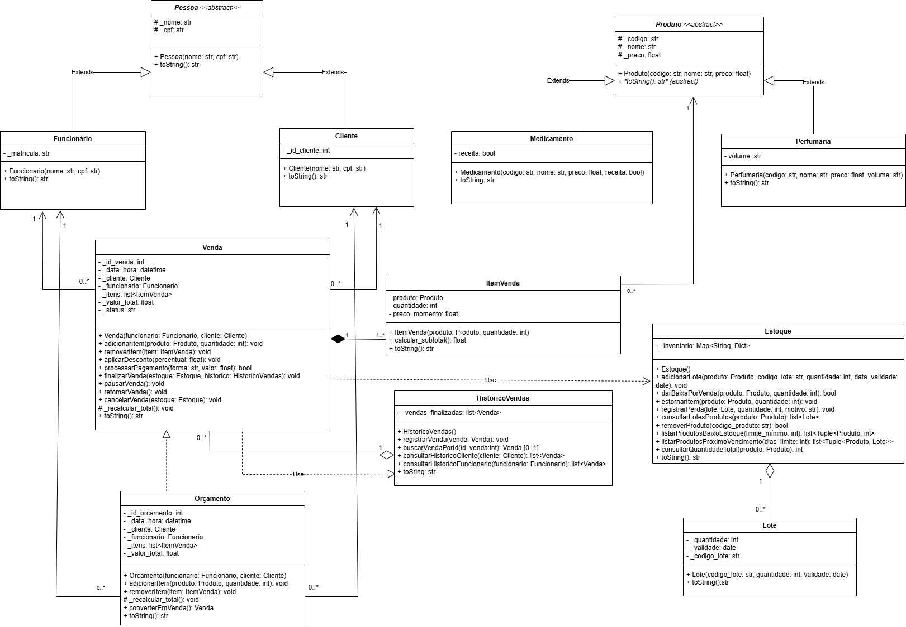

# Projeto de Gestão de Farmácia em POO

Projeto acadêmico desenvolvido para a disciplina de Orientação a Objetos da Universidade de Brasília (UnB). O sistema simula as principais operações de uma farmácia, utilizando conceitos fundamentais de POO.

## Tecnologias Utilizadas
* **Linguagem:** Python 3.13.0
* **Design e Modelagem:** UML (Diagrama de Classes e Casos de Uso)
* **Ferramenta de Diagramação:** Draw.io

## Estrutura do Projeto
O projeto está organizado da seguinte forma para separar responsabilidades:

```
PROJETOOO/
│
├── 📁 projeto-farmacia-oo/
│   ├── 📁 farmacia/
│   │   ├── 📁 entidades/
│   │   │   ├── 📜 pessoa.py
│   │   │   └── 📜 produto.py
│   │   └── 📁 servicos/
│   │       ├── 📜 estoque.py
│   │       └── 📜 venda.py
│   ├── 📜 main.py
│   ├── 📜 teste_entidades.py
│   ├── 📜 teste_estoque.py
│   └── 📜 teste_venda.py
│
├── 📁 UML/
│
└── 📜 README.md
```
## Arquitetura do Sistema (Diagrama de Classes)
O sistema foi modelado com 12 classes, separadas em Entidades, Transações e Serviços, demonstrando as relações de Herança, Composição, Agregação, Associação e Dependência.




## Funcionalidades Implementadas
O sistema implementa mais de 40 métodos, cobrindo os seguintes casos de uso:

#### Módulo do Caixa
* Realização de Vendas (com adição e remoção de itens)
* Aplicação de Descontos
* Processamento de Pagamento (com cálculo de troco)
* Pausa e Retomada de Vendas
* Cancelamento de Vendas (com lógica de estorno no estoque)
* Finalização e Registro no Histórico

#### Módulo do Balcão
* CRUD completo para Produtos, Clientes e Funcionários.
* Criação de Orçamentos (com conversão para Venda).
* Consulta de históricos de compras (por cliente) e de vendas (por funcionário).
* Gestão de Lotes com data de validade.
* Lógica de baixa PEPS (Primeiro que Expira, Primeiro que Sai).
* Registro de Perdas e Avarias.
* Geração de relatórios de baixo estoque e produtos a vencer.

## Como Executar
Para executar o projeto, abra um terminal na pasta raiz `PROJETOOO/` e siga os passos abaixo.

1.  **Navegue para a pasta principal do código:**
    ```bash
    cd projeto-farmacia-oo
    ```

2.  **Execute os scripts desejados:**
    * **Para os Testes Unitários:**
        ```bash
        python teste_estoque.py
        ```
    * **Para a Demonstração Interativa:**
        ```bash
        python main.py
        ```

## Autor
* **Henrique Mendes Elias**